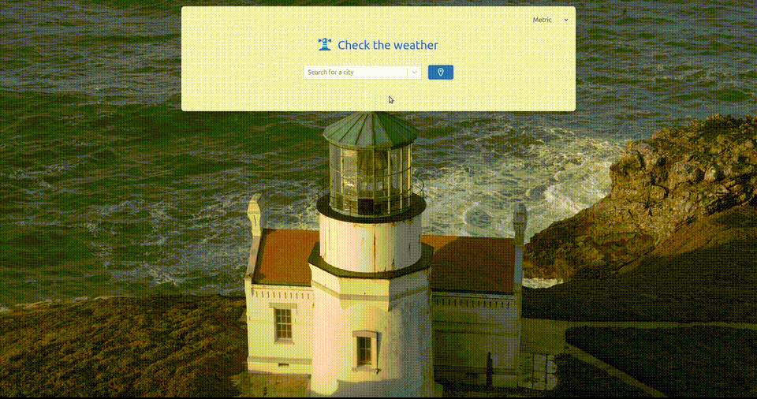

# Weather Forecast Application

This is a Weather Forecast application built using React. It allows users to 
get current weather information, search for locations, and view weather forecasts 
for multiple days. The application also includes features such as unit conversion, 
visual representation of weather conditions, dynamic background images, responsive 
design, error handling, and a user-friendly interface.

## Features

The Weather Forecast application provides an intuitive and visually appealing user 
interface. Users can perform the following actions:

- Enter a location in the search bar to get weather information for that location.
- Toggle between different units of measurement (Celsius/Fahrenheit for temperature, 
kilometers per hour/miles per hour for wind speed).
- View the current weather conditions, including temperature, humidity, wind speed, 
and weather description.
- Explore the multi-day forecast, which displays weather information for the upcoming 
days.
- Enjoy a responsive design that adapts to different screen sizes.
- Experience dynamic background images that reflect the current weather conditions or 
change based on the time of day.
- Receive appropriate error messages when a location is not found or when there are 
issues with retrieving weather data.

## Installation

To run the Weather Forecast application locally, follow these steps:

1. Clone the repository: `git clone https://github.com/fj-vega/weather-forecast.git`
2. Navigate to the project directory: `cd weather-forecast`
3. Create a [OpenWeather account](https://openweathermap.org/)
4. Obtain your [OpenWeather API key](https://home.openweathermap.org/api_keys)
5. Create a file named `.env` in this folder with the following content
    `VITE_OPENWEATHER_API_KEY=your_api_key`
7. Install the dependencies: `npm install`
7. Start the development server: `npm dev`
8. Visit the url specified by Vite in your terminal to access the application.

## Data Source

- Geolocation information from [Nominatim](https://nominatim.org/)
- Weather information from [OpenWeather](https://openweathermap.org/)

## License

The Weather Forecast application is open-source and released under the 
[MIT License](https://opensource.org/licenses/MIT). 
Feel free to modify and distribute the application as per the license terms.